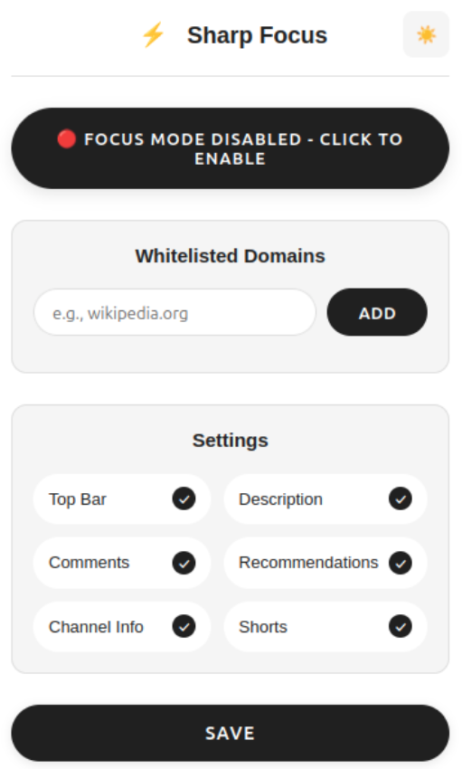
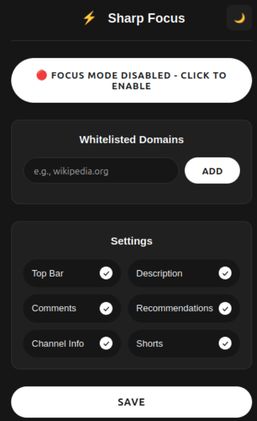
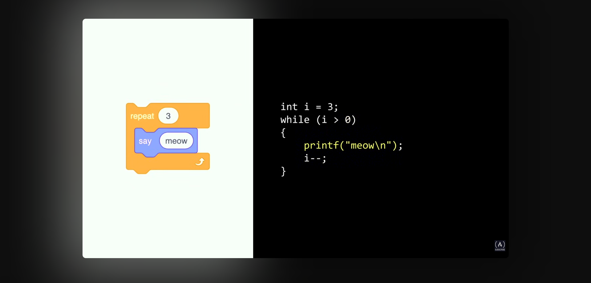
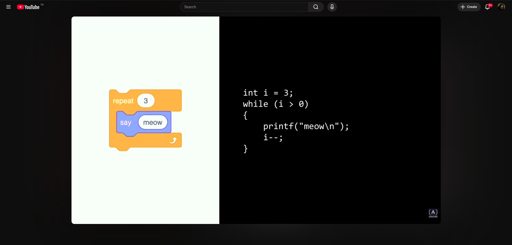

**SharpFocus** is a small, privacy-friendly Firefox extension that helps you stay focused while watching YouTube by removing distractions and providing a global focus overlay for other tabs.

## 🚀 Get the extension

- Install from Firefox Add-ons: https://addons.mozilla.org/en-US/firefox/addon/sharpfocus/

## ✨ Key Features

- **Distraction-Free YouTube** — Hide non-essential UI on YouTube watch pages (top bar, descriptions, comments, recommendations, Shorts, and more).
- **Global Focus Overlay** — Block interactions on non-whitelisted tabs while focus mode is active.
- **Domain Whitelisting** — Allow full access to trusted domains during focus sessions.
- **Light & Dark Themes** — Popup and overlay support both themes for better readability.
- **Persistent Settings** — All preferences (whitelist, hidden elements, theme) are saved using browser storage.
- **Auto Activation** — Focus mode automatically activates when a video starts playing and turns off when it ends.

## 📸 Screenshots

**Light Theme Popup:** Extension interface in light mode.

**Dark Theme Popup:** Extension interface in dark mode.

**Full Block Mode:** All distractions removed for maximum focus.

**Show Top Bar Only:** Minimal UI with top navigation visible.

## 🔧 Installation (Developer)

1. Clone the repository:

   git clone https://github.com/Machamelli/SharpFocus.git

2. Open Firefox and go to `about:debugging#/runtime/this-firefox`.
3. Click **Load Temporary Add-on** and select `manifest.json` from the project root.

## 📚 Usage

- Open the SharpFocus popup from the toolbar.
- Toggle Focus Mode with the main button.
- Add domains to the whitelist to exempt them from the overlay.
- Toggle which YouTube elements to hide in settings and switch between themes.

## 🤝 Contributing

Contributions are welcome — pull requests, issues, and suggestions are appreciated. Please fork the repo and open a PR describing your change.

## 📝 License

This project is licensed under the **MIT License**. See the [`LICENSE`](LICENSE) file for details.

---

Made with ❤️ and a focus on simplicity. Enjoy staying sharper with SharpFocus!
